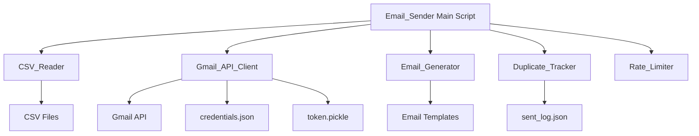

# Design Document: Gmail Cold Email Sender

## Overview

The Gmail Cold Email Sender is a Python command-line script that automates personalized cold email outreach campaigns. The system reads lead data from CSV files, generates customized email content based on lead characteristics (pitch type and location), and sends emails through the Gmail API while preventing duplicates and respecting rate limits.

### Key Design Principles

1. **Separation of Concerns**: Each component (CSV reading, email generation, duplicate tracking, rate limiting, Gmail API interaction) is isolated for testability and maintainability
2. **Fail-Safe Operation**: Individual email failures don't halt the entire process
3. **Idempotency**: Duplicate prevention ensures leads are never contacted twice
4. **Configurability**: All settings are exposed as constants at the script top
5. **User Feedback**: Real-time progress reporting keeps users informed

### Technology Stack

- **Language**: Python 3.7+
- **Gmail Integration**: Google API Python Client (`google-auth`, `google-auth-oauthlib`, `google-api-python-client`)
- **Data Formats**: CSV for input, JSON for state persistence
- **Authentication**: OAuth2 with token caching

## Architecture

### Component Diagram



### Data Flow

1. **Initialization Phase**:
   - Load configuration constants
   - Authenticate with Gmail API (check credentials.json, load/refresh token.pickle)
   - Load sent_log.json for duplicate tracking
   - Open and parse CSV file

2. **Processing Phase** (for each lead):
   - Check if email already sent (Duplicate_Tracker)
   - If duplicate, skip and continue
   - Extract lead data and determine Location_Type
   - Generate personalized email content (Email_Generator)
   - Send email via Gmail API (Gmail_API_Client)
   - Update sent_log.json (Duplicate_Tracker)
   - Apply rate limit delay (Rate_Limiter)
   - Print progress message
   - Check if daily limit reached

3. **Completion Phase**:
   - Print summary statistics
   - Exit cleanly

## Components and Interfaces

### 1. Email_Sender (Main Orchestrator)

**Responsibility**: Coordinates all components and manages the email sending workflow

**Interface**:
```python
def main():
    """Main entry point for the email sender script"""
    pass

def display_setup_instructions():
    """Print OAuth setup instructions when credentials.json is missing"""
    pass
```

**Configuration Constants** (defined at module level):
```python
DAILY_LIMIT: int = 50
DELAY_SECONDS: int = 30
SENDER_NAME: str = "Rishi Rohan Sawant"
SENDER_EMAIL: str = "rishi.sawant2005@gmail.com"
SENDER_PHONE: str = "+91 86938 52452"
SENDER_PORTFOLIO: str = "https://inforishi.netlify.app"
CSV_FILENAME: str = "indian_leads_FINAL.csv"  # or "international_leads_part1.csv"
```

### 2. CSV_Reader

**Responsibility**: Parse CSV files and extract lead data

**Interface**:
```python
def read_leads(filename: str) -> List[Dict[str, str]]:
    """
    Read and parse CSV file containing lead data
    
    Args:
        filename: Path to CSV file
        
    Returns:
        List of lead dictionaries with keys: name, username, email, phone,
        category, bio, website, followerCount, pitch_type, price
        
    Skips rows with missing email field
    """
    pass

def extract_location_type(price: str) -> str:
    """
    Determine location type from price column
    
    Args:
        price: Price string containing ₹ or $ symbol
        
    Returns:
        "Indian" if ₹ symbol present, "International" if $ symbol present
    """
    pass
```

### 3. Gmail_API_Client

**Responsibility**: Handle Gmail API authentication and email sending

**Interface**:
```python
def authenticate() -> Resource:
    """
    Authenticate with Gmail API using OAuth2
    
    Returns:
        Gmail API service resource
        
    Raises:
        FileNotFoundError: If credentials.json is missing
    """
    pass

def send_email(service: Resource, to: str, subject: str, body: str) -> bool:
    """
    Send an email via Gmail API
    
    Args:
        service: Authenticated Gmail API service
        to: Recipient email address
        subject: Email subject line
        body: Email body content (plain text)
        
    Returns:
        True if sent successfully, False otherwise
    """
    pass

def create_message(to: str, subject: str, body: str) -> Dict:
    """
    Create a MIME message for Gmail API
    
    Args:
        to: Recipient email address
        subject: Email subject line
        body: Email body content
        
    Returns:
        Dictionary with base64-encoded message
    """
    pass
```

### 4. Email_Generator

**Responsibility**: Generate personalized email content based on lead characteristics

**Interface**:
```python
def generate_email(lead: Dict[str, str], location_type: str) -> Tuple[str, str]:
    """
    Generate personalized email subject and body
    
    Args:
        lead: Dictionary containing lead data (name, pitch_type, etc.)
        location_type: "Indian" or "International"
        
    Returns:
        Tuple of (subject, body)
    """
    pass

def get_greeting(name: str) -> str:
    """
    Extract first name for greeting, or return "there" if name is missing
    
    Args:
        name: Full name from lead data
        
    Returns:
        First name or "there"
    """
    pass
```

**Email Templates**:

The Email_Generator uses four template combinations based on (pitch_type, location_type):

1. **Website + Indian**: Subject "Quick question about your online presence", price ₹12,000-15,000
2. **Management Tool + Indian**: Subject "Are you still managing your operations manually?", price ₹40,000+
3. **Website + International**: Subject "Your business deserves a better website", price starting $100
4. **Management Tool + International**: Subject "Are you managing your business with spreadsheets?", price starting $600

All templates include:
- Personalized greeting with first name
- Project references: dental clinic, law firm, ecommerce in Mumbai
- Management Tool templates also mention Legal Management System and Business Dashboard
- Signature block with sender details

### 5. Duplicate_Tracker

**Responsibility**: Maintain persistent record of sent emails to prevent duplicates

**Interface**:
```python
def load_sent_log() -> Set[str]:
    """
    Load sent email addresses from sent_log.json
    
    Returns:
        Set of email addresses that have been sent to
    """
    pass

def is_duplicate(email: str, sent_log: Set[str]) -> bool:
    """
    Check if email address has already been sent to
    
    Args:
        email: Email address to check
        sent_log: Set of previously sent email addresses
        
    Returns:
        True if duplicate, False otherwise
    """
    pass

def mark_as_sent(email: str, sent_log: Set[str]) -> None:
    """
    Add email address to sent log and persist to disk
    
    Args:
        email: Email address to mark as sent
        sent_log: Set of sent email addresses (modified in place)
        
    Side effects:
        Updates sent_log.json file
    """
    pass
```

**File Format** (sent_log.json):
```json
[
  "email1@example.com",
  "email2@example.com"
]
```

### 6. Rate_Limiter

**Responsibility**: Enforce sending limits and delays

**Interface**:
```python
def should_continue(sent_count: int, daily_limit: int) -> bool:
    """
    Check if daily limit has been reached
    
    Args:
        sent_count: Number of emails sent in current run
        daily_limit: Maximum emails per run
        
    Returns:
        True if can continue sending, False if limit reached
    """
    pass

def apply_delay(delay_seconds: int) -> None:
    """
    Wait between email sends
    
    Args:
        delay_seconds: Number of seconds to wait
    """
    pass
```

## Data Models

### Lead Record

```python
@dataclass
class Lead:
    name: str
    username: str
    email: str
    phone: str
    category: str
    bio: str
    website: str
    followerCount: str
    pitch_type: str  # "Website" or "Management Tool"
    price: str       # Contains ₹ or $ symbol
```

### Email Message

```python
@dataclass
class EmailMessage:
    to: str
    subject: str
    body: str
```

### Execution Statistics

```python
@dataclass
class ExecutionStats:
    sent_current_run: int
    failed_current_run: int
    total_ever_sent: int
```


## Correctness Properties

*A property is a characteristic or behavior that should hold true across all valid executions of a system—essentially, a formal statement about what the system should do. Properties serve as the bridge between human-readable specifications and machine-verifiable correctness guarantees.*

### Property 1: CSV Column Parsing Completeness

*For any* CSV file with the required columns (name, username, email, phone, category, bio, website, followerCount, pitch_type, price), the CSV_Reader SHALL successfully parse all columns and return lead records containing all field values.

**Validates: Requirements 1.2**

### Property 2: Email Field Filtering

*For any* CSV file containing a mix of rows with and without email fields, the CSV_Reader SHALL return only those lead records where the email field is present and non-empty.

**Validates: Requirements 1.3**

### Property 3: Location Type Detection

*For any* price string containing a currency symbol, the extract_location_type function SHALL return "Indian" when the ₹ symbol is present and "International" when the $ symbol is present.

**Validates: Requirements 1.4, 10.3**

### Property 4: Email Content Generation Correctness

*For any* lead with a valid pitch_type ("Website" or "Management Tool") and location_type ("Indian" or "International"), the Email_Generator SHALL produce an email with the correct subject line and price range corresponding to that specific pitch_type/location_type combination.

**Validates: Requirements 3.1, 3.2, 3.3, 3.4**

### Property 5: Greeting Name Extraction

*For any* lead record, the get_greeting function SHALL return the first name from the name field if present, or "there" if the name field is empty or missing.

**Validates: Requirements 3.5**

### Property 6: Email Content Completeness

*For any* lead record, the generated email body SHALL contain all required elements: project references (dental clinic, law firm, ecommerce in Mumbai), Management Tool-specific mentions (when pitch_type is "Management Tool"), and complete signature block (sender name, title, phone, portfolio URL).

**Validates: Requirements 3.6, 3.7, 3.8**

### Property 7: Duplicate Detection

*For any* email address and any set of previously sent email addresses, the is_duplicate function SHALL return true if and only if the email address exists in the sent log set.

**Validates: Requirements 4.2**

### Property 8: Rate Limit Enforcement

*For any* sent count and daily limit, the should_continue function SHALL return true if sent_count < daily_limit and false if sent_count >= daily_limit.

**Validates: Requirements 5.1**

### Property 9: Progress Message Formatting

*For any* lead record, sent count, total count, and optional error message, the progress output SHALL follow the format "[sent_count/total_count] ✅ Lead_name (email_address)" for success or "[sent_count/total_count] ❌ Lead_name (email_address) - failure_reason" for failure.

**Validates: Requirements 6.1, 6.2**

### Property 10: Summary Statistics Formatting

*For any* execution statistics (sent_current_run, failed_current_run, total_ever_sent), the summary output SHALL include all three values with clear labels.

**Validates: Requirements 6.3**

### Property 11: Setup Instructions Completeness

*For any* missing credentials scenario, the setup instructions SHALL contain all required elements: Google Cloud Console URL, project creation steps, Gmail API enablement instructions, OAuth credential creation steps for Desktop App, credentials.json filename specification, required pip packages, and the specific email address to use (rishi.sawant2005@gmail.com).

**Validates: Requirements 9.2, 9.3, 9.4**

## Error Handling

### Error Categories

1. **Configuration Errors**:
   - Missing credentials.json: Display setup instructions and exit cleanly (no exception)
   - Invalid/expired token.pickle: Trigger re-authentication flow
   - Missing CSV file: Log error and exit with clear message

2. **Data Errors**:
   - Malformed CSV: Skip invalid rows, log warning, continue processing
   - Missing required fields: Skip row, log warning, continue processing
   - Invalid pitch_type or location_type: Use default template or skip lead

3. **API Errors**:
   - Gmail API rate limit exceeded: Log error, skip lead, continue processing
   - Network timeout: Log error, skip lead, continue processing
   - Authentication failure: Log error and exit (requires user intervention)

4. **File I/O Errors**:
   - Cannot write sent_log.json: Log error but continue (risk of duplicates)
   - Cannot read sent_log.json: Start with empty set, log warning

### Error Handling Strategy

**Fail-Safe Principle**: Individual lead failures should never halt the entire batch process.

**Implementation**:
```python
for lead in leads:
    try:
        # Process lead
        if is_duplicate(lead.email, sent_log):
            continue
        
        subject, body = generate_email(lead, location_type)
        success = send_email(service, lead.email, subject, body)
        
        if success:
            mark_as_sent(lead.email, sent_log)
            print_success_message(lead)
            sent_count += 1
        else:
            print_failure_message(lead, "Send failed")
            failed_count += 1
            
    except Exception as e:
        print_failure_message(lead, str(e))
        failed_count += 1
        continue  # Always continue to next lead
```

**Logging**:
- All errors are printed to stdout with clear context (lead name, email, error reason)
- No silent failures
- Summary statistics include failure count

## Testing Strategy

### Unit Tests

Unit tests will verify specific examples, edge cases, and error conditions:

**CSV_Reader Tests**:
- Parse valid CSV with all columns present
- Handle missing email field (skip row)
- Handle empty CSV file
- Handle malformed CSV rows
- Extract location type from various price formats (₹12000, $100, ₹ 15,000, $ 500)

**Email_Generator Tests**:
- Generate email for each of 4 pitch_type/location_type combinations
- Handle missing lead name (use "there")
- Handle empty lead name
- Handle single-word names vs multi-word names
- Verify all required content elements are present

**Duplicate_Tracker Tests**:
- Detect duplicate in existing sent log
- Detect non-duplicate
- Handle empty sent log
- Load and save sent_log.json correctly

**Rate_Limiter Tests**:
- Enforce daily limit at boundary (49, 50, 51 emails)
- Verify delay is applied (mock time.sleep)

**Gmail_API_Client Tests**:
- Handle missing credentials.json gracefully
- Create properly formatted MIME messages
- Mock Gmail API calls for send_email

**Error Handling Tests**:
- Missing credentials.json displays instructions
- Individual send failure doesn't stop processing
- Malformed CSV row is skipped

### Property-Based Tests

Property-based tests will verify universal properties across randomized inputs using **Hypothesis** (Python PBT library):

**Configuration**: Minimum 100 iterations per property test

**Test Implementation**:

1. **Property 1: CSV Column Parsing Completeness**
   - Generate random CSV data with all required columns
   - Verify all fields are present in parsed output
   - Tag: `Feature: gmail-cold-email-sender, Property 1: CSV Column Parsing Completeness`

2. **Property 2: Email Field Filtering**
   - Generate random CSV data with some rows missing emails
   - Verify output contains only rows with emails
   - Tag: `Feature: gmail-cold-email-sender, Property 2: Email Field Filtering`

3. **Property 3: Location Type Detection**
   - Generate random price strings with ₹ or $ symbols
   - Verify correct location type is returned
   - Tag: `Feature: gmail-cold-email-sender, Property 3: Location Type Detection`

4. **Property 4: Email Content Generation Correctness**
   - Generate random lead data with all pitch_type/location_type combinations
   - Verify subject and price match expected values for each combination
   - Tag: `Feature: gmail-cold-email-sender, Property 4: Email Content Generation Correctness`

5. **Property 5: Greeting Name Extraction**
   - Generate random names (full names, single names, empty strings)
   - Verify greeting contains first name or "there"
   - Tag: `Feature: gmail-cold-email-sender, Property 5: Greeting Name Extraction`

6. **Property 6: Email Content Completeness**
   - Generate random lead data
   - Verify all required content elements are present in generated email
   - Tag: `Feature: gmail-cold-email-sender, Property 6: Email Content Completeness`

7. **Property 7: Duplicate Detection**
   - Generate random email addresses and sent logs
   - Verify duplicate detection is correct
   - Tag: `Feature: gmail-cold-email-sender, Property 7: Duplicate Detection`

8. **Property 8: Rate Limit Enforcement**
   - Generate random sent counts and limits
   - Verify should_continue returns correct boolean
   - Tag: `Feature: gmail-cold-email-sender, Property 8: Rate Limit Enforcement`

9. **Property 9: Progress Message Formatting**
   - Generate random lead data, counts, and error messages
   - Verify output format matches specification
   - Tag: `Feature: gmail-cold-email-sender, Property 9: Progress Message Formatting`

10. **Property 10: Summary Statistics Formatting**
    - Generate random statistics
    - Verify summary contains all required values
    - Tag: `Feature: gmail-cold-email-sender, Property 10: Summary Statistics Formatting`

11. **Property 11: Setup Instructions Completeness**
    - Verify instructions contain all required elements
    - Tag: `Feature: gmail-cold-email-sender, Property 11: Setup Instructions Completeness`

### Integration Tests

Integration tests will verify end-to-end behavior with external services:

- **Gmail API Integration**: Send test email via real Gmail API (requires credentials)
- **OAuth Flow**: Complete authentication flow with real Google OAuth
- **File Persistence**: Verify sent_log.json is created and updated correctly
- **CSV File Reading**: Read actual CSV files (indian_leads_FINAL.csv, international_leads_part1.csv)
- **Rate Limiting**: Verify delays are applied in real execution
- **Duplicate Prevention**: Run script twice with same leads, verify no duplicates sent

### Test Coverage Goals

- **Unit Test Coverage**: 90%+ for pure functions (Email_Generator, CSV_Reader, Duplicate_Tracker logic, Rate_Limiter logic)
- **Property Test Coverage**: All 11 correctness properties implemented
- **Integration Test Coverage**: All external service interactions (Gmail API, file I/O, OAuth)

## Implementation Notes

### Dependencies

```python
# requirements.txt
google-auth>=2.0.0
google-auth-oauthlib>=0.5.0
google-auth-httplib2>=0.1.0
google-api-python-client>=2.0.0
hypothesis>=6.0.0  # For property-based testing
pytest>=7.0.0      # For unit tests
```

### File Structure

```
gmail-cold-email-sender/
├── email_sender.py           # Main script
├── credentials.json          # OAuth credentials (user-provided)
├── token.pickle              # Cached auth token (generated)
├── sent_log.json            # Sent email log (generated)
├── indian_leads_FINAL.csv   # Lead data (user-provided)
├── international_leads_part1.csv  # Lead data (user-provided)
├── requirements.txt         # Python dependencies
├── tests/
│   ├── test_csv_reader.py
│   ├── test_email_generator.py
│   ├── test_duplicate_tracker.py
│   ├── test_rate_limiter.py
│   ├── test_gmail_client.py
│   ├── test_properties.py   # Property-based tests
│   └── test_integration.py  # Integration tests
└── README.md               # Setup and usage instructions
```

### Security Considerations

1. **Credential Storage**: credentials.json and token.pickle contain sensitive data and should be excluded from version control (.gitignore)
2. **Email Addresses**: sent_log.json contains PII and should be handled according to data protection requirements
3. **Rate Limiting**: Respect Gmail's sending limits to avoid account suspension
4. **OAuth Scopes**: Request minimal required scopes (gmail.send only)

### Performance Considerations

1. **Batch Processing**: Process leads sequentially (no parallelization needed for 50 emails/day limit)
2. **Memory Usage**: Load entire CSV into memory (acceptable for typical lead list sizes < 10,000 rows)
3. **Disk I/O**: Write sent_log.json after each send (ensures durability, acceptable overhead for 30-second delays)
4. **API Calls**: Single API call per email (no optimization needed)

### Extensibility Points

1. **Email Templates**: Easily add new pitch types by extending Email_Generator
2. **CSV Formats**: Support additional columns by updating Lead dataclass
3. **Rate Limits**: Configurable via constants (DAILY_LIMIT, DELAY_SECONDS)
4. **Tracking**: sent_log.json format can be extended to include timestamps, campaign IDs, etc.
5. **Reporting**: Summary statistics can be extended with additional metrics

